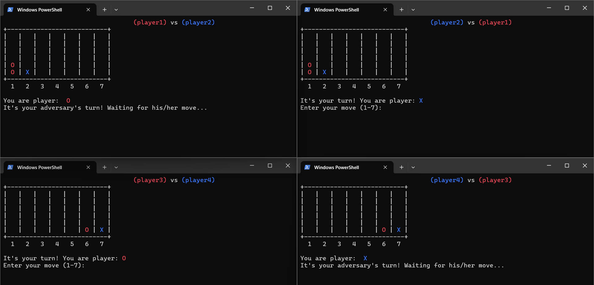

# Connect Four
A simple connect four game implementation using Python. 

It uses a client-server logic to allow multiple players. 

The full documentation can be found [here](docs/documentazione_progetto.pdf).

## Running 
This program uses Python 3.11


### Server
First of all, the server must start:
```
python server.py
```

By default, the server will listen for new connections on localhost:3000.

To shutdown the server the user can simply press CTRL+C.

### Client
Once the server starts, the clients can start too:
```
python client.py
```

After this command, the program will connect to the server, the user will choose an univoque valid name and (possibly) wait for a new player to join the game. After the player is paired with another player, the game will start. The two players will see the same scoreboard and will play a turn (one after the other). The game will stop (for both players) when a player wins the game.


<!--
## Example
Here there is an example of execution of the game, after the server was started:



The two top terminals represent a match between <i>player1</i> and <i>player2</i>. The first terminal is the one of the first player, while the second terminal is the one of the second player.

The two bottom terminals represent another match, between <i>player3</i> and <i>player4</i>.

Of course, <i>player1</i> and <i>player2</i> will not see the moves that the other two players (<i>player3</i> and <i>player4</i>) do and vice-versa. 
<br><br>

Now, if another player tries to play with an already chosen name, there will be an error, and a new name will be asked. 
Also, if there is no one the player can be paired with, it will be communicated and the user will have to wait until someone  joins the game.


-->